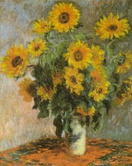

# median-blur-aspose
simple image processing project making median blur using aspose library python

changing option can regulate strength of blurring. Getting that amount of surrounding pixels, rewrite them in line and take median from that, this is our RGB value

